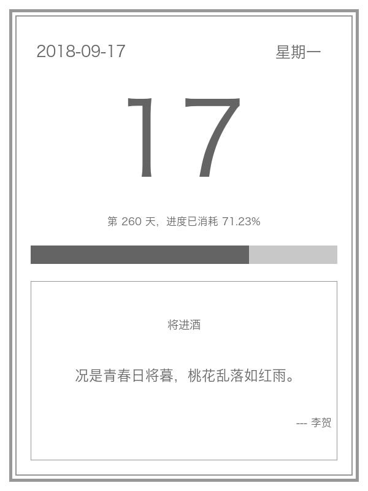

# DailyImage

日签 Or 日历，生成一张当日的图片。Just For Fun!👏

## 使用

如果需要在项目中使用，在你的gemfile中添加以下代码

```ruby
gem 'daily_image'
```

然后执行下面的命令

    $ bundle

或者，你可以直接安装使用

    $ gem install daily_image

## 使用

### 配置使用

当你需要项目使用时，可以通过下面方式修改默认配置：

```ruby

# 初始项目配置
DailyImage.configure do |config|
  config[:bg_color] = [255, 255, 255]        # 背景颜色
  config[:frame_color] = [151, 158, 160]     # 边框颜色
  config[:text_color] = [100, 145, 170]      # 文字颜色
  config[:date_color] = [100, 145, 170]      # 中间日期颜色
  config[:unused_color] = [200, 205, 215]    # 进度条未使用颜色
  config[:used_color] = [100, 145, 170]      # 进度条已使用颜色
  config[:out_frame_offset] = 15             # 外层边框偏移量
  config[:in_frame_offset] = 50              # 下半部分内层边框偏移量
  config[:font] = 'Hiragino Sans GB'         # 文字默认字体
end

# 调用方法
DailyImage.draw_image(output_path)           # 默认图片存放地址，包所在的目录

# 例子
DailyImage.draw_image('./')
```

### 命令行

如果是直接安装，可以通过命令行直接调用。**当然，还是需要安装ruby以及对应的依赖**

```shell
$ bundle exec daily_image -h
Usage: daily_image [options]

Specific options:
    -b, --bg_color BG_COLOR          the image's background color
    -r, --frame_color FRAME_COLOR    the image's frame color
    -t, --text_color TEXT_COLOR      the image's text color
    -d, --date_color DATE_COLOR      the middle date's text color
    -n, --unused_color UNUSED_COLOR  unused color of the progress bar
    -u, --used_color USED_COLOR      used color of the progress bar
    -o OUT_FRAME_OFFSET,             the outside frame offset
        --out_offset
    -i, --in_offset IN_FRAME_OFFSET  the inside frame offset
    -f, --font FONT                  the text font
    -s, --output OUTPUT              the output path, save the new image

Common options:
    -h, --help                       Show the help message
    -v, --version                    Show version

```

## 示例



## 感谢🙏

站在巨人的肩膀上

1. 画图使用了 [ruby-vips](https://github.com/jcupitt/ruby-vips)

2. 诗词来自于 [一言·古诗词 API](https://github.com/xenv/gushici)

## 如何贡献

1. Fork it
2. Create your feature branch (`git checkout -b my-new-feature`)
3. Commit your changes (`git commit -am 'Add some feature'`)
4. Push to the branch (`git push origin my-new-feature`)
5. Create new Pull Request

欢迎贡献相关代码或是反馈使用时遇到的问题👏，另外请记得为你的代码编写测试。
